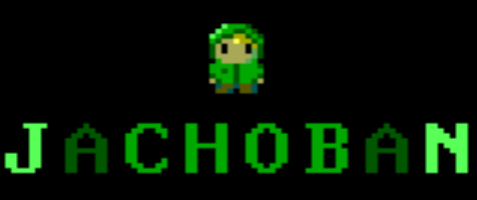

<h1 align="center">
  <br />
  
  <br/>
  <br/>
  Jachoban
  <br/>
  
  
  <br/>
</h1>

### MENU
1. The application will start with the Player Menu. 
2. The Player Menu will prompt the player to choose whether to start the game by pressing ‘1’, view the high scores by pressing ‘2’, or end the game (quit the application) by pressing ‘3’.

### STARTING THE GAME
1. If one is not familiar with Sokoban, the game will start with an N x N board (in our project’s case, we will start with 10x10). 
2. The board will have 4 types of tiles: Floor, Wall, Point, Box.
3. Every board will have an equal number of point tiles and box tiles.
4. The player will control a character named <b> the jacherman </b>
5. The goal of the player is to control <b> the jacherman </b> ‘push’ the box tiles into all the point tiles.
6. The player can use the following keys to move <b> the jacherman </b>:
- ‘W’ or ‘w’ to move up
- ‘A’ or ‘a’ to move left
- ‘S’ or ‘s’ to move down
- ‘D’ or ‘d’ to move right    
7. The player loses if he/she pushes a box and the box is rendered unable to reach its corresponding point tile (e.g the box gets stuck in a corner).
8. For every 5 boards the player solves, the game will increase difficulty by increasing the number of point tiles and boxes and by increasing the board size (up to 15x15).
9. If the player wins the game (solves all boards available), his/her score will be added to the high scores list. 
10. Quitting the game
```
The player can quit anytime by pressing the key ‘3’.
```

### RUNNING THE GAME
```
./rebuild.sh
```